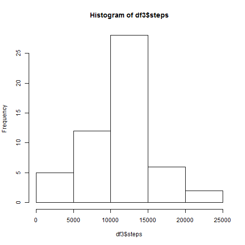
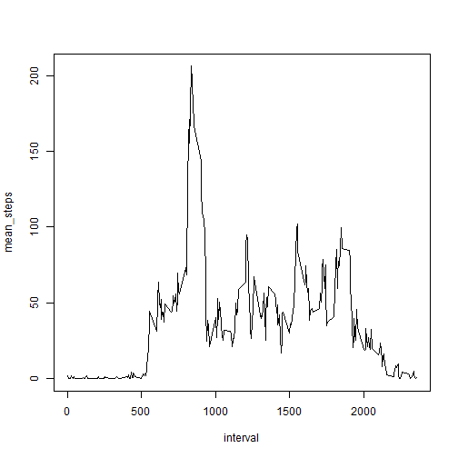
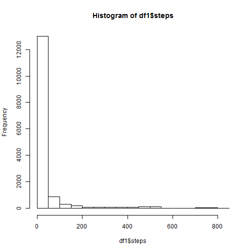
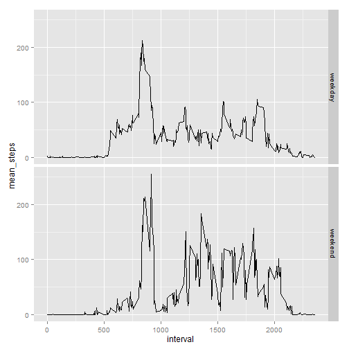

This is an R Markdown document for the Reproducable Research project #1.

Loading and preprocessing the data:

Show any code that is needed to

   * Load the data (i.e. read.csv())

   * Process/transform the data (if necessary) into a format suitable for analysis


```r
library(dplyr)
library(ggplot2)
library(knitr)
setwd("C:/Users/Shekhar/Documents/Johns Hopkins/Data")
df1 <- read.csv("activity.csv")
df1 <- tbl_df(df1) # store original data in a better dplyr format
df2 <- na.omit(df1)# remove NA values and store in df2

df2_by_day <- group_by(df2,date)
df3 <- summarize(df2_by_day,sum(steps))
names(df3) <- c("date","steps")
```
### Total number of steps taken each day

```r
kable(df3)
```


|date       | steps|
|:----------|-----:|
|2012-10-02 |   126|
|2012-10-03 | 11352|
|2012-10-04 | 12116|
|2012-10-05 | 13294|
|2012-10-06 | 15420|
|2012-10-07 | 11015|
|2012-10-09 | 12811|
|2012-10-10 |  9900|
|2012-10-11 | 10304|
|2012-10-12 | 17382|
|2012-10-13 | 12426|
|2012-10-14 | 15098|
|2012-10-15 | 10139|
|2012-10-16 | 15084|
|2012-10-17 | 13452|
|2012-10-18 | 10056|
|2012-10-19 | 11829|
|2012-10-20 | 10395|
|2012-10-21 |  8821|
|2012-10-22 | 13460|
|2012-10-23 |  8918|
|2012-10-24 |  8355|
|2012-10-25 |  2492|
|2012-10-26 |  6778|
|2012-10-27 | 10119|
|2012-10-28 | 11458|
|2012-10-29 |  5018|
|2012-10-30 |  9819|
|2012-10-31 | 15414|
|2012-11-02 | 10600|
|2012-11-03 | 10571|
|2012-11-05 | 10439|
|2012-11-06 |  8334|
|2012-11-07 | 12883|
|2012-11-08 |  3219|
|2012-11-11 | 12608|
|2012-11-12 | 10765|
|2012-11-13 |  7336|
|2012-11-15 |    41|
|2012-11-16 |  5441|
|2012-11-17 | 14339|
|2012-11-18 | 15110|
|2012-11-19 |  8841|
|2012-11-20 |  4472|
|2012-11-21 | 12787|
|2012-11-22 | 20427|
|2012-11-23 | 21194|
|2012-11-24 | 14478|
|2012-11-25 | 11834|
|2012-11-26 | 11162|
|2012-11-27 | 13646|
|2012-11-28 | 10183|
|2012-11-29 |  7047|

### Histogram of Total number of steps taken each day

```r
hist(df3$steps)
```

 


```r
steps_mean <- as.integer(round(mean(df3$steps),digits=0))
steps_median <- median(df3$steps)
```

Mean of total number of steps per day is 10766
Median of total number of steps per day is 10765

  
### Average Daily Activity Pattern

```r
df2_by_interval <- group_by(df2,interval)
df4 <- summarize(df2_by_interval,mean(steps))
names(df4) <- c("interval","mean_steps")
with(df4,plot(interval,mean_steps,type="l"))
```

 

### Which 5-minute interval, on average across all the days in the dataset, contains the maximum number of steps

```r
i <- which.max(df4$mean_steps)
max_steps <- round(max(df4$mean_steps),digits=2)
interval_max_steps <- df4$interval[i]
```
#### The maximum number of steps is 206.17, and the interval that contains this max value is 835

### Imputing Missing Values

```r
original_rows <- nrow(df1)
na_rows <- nrow(df1) - nrow(df2)
```
#### There are 17568 rows in the original Excel data file, of which 2304 rows have missing (NA) values 

### Devise a strategy for filling in all of the missing values in the dataset. The strategy uses the mean for that 5-minute interval.

Create a new dataset (df6) that is equal to the original dataset (df1) but with the missing data filled in.


```r
ix <- is.na(df1$steps)
df5 <- left_join(df1,df4,by="interval")
head(df5)
```

```
## Source: local data frame [6 x 4]
## 
##   steps       date interval mean_steps
## 1    NA 2012-10-01        0  1.7169811
## 2    NA 2012-10-01        5  0.3396226
## 3    NA 2012-10-01       10  0.1320755
## 4    NA 2012-10-01       15  0.1509434
## 5    NA 2012-10-01       20  0.0754717
## 6    NA 2012-10-01       25  2.0943396
```

```r
df5$steps[ix] <- df5$mean_steps[ix]
head(df5)
```

```
## Source: local data frame [6 x 4]
## 
##       steps       date interval mean_steps
## 1 1.7169811 2012-10-01        0  1.7169811
## 2 0.3396226 2012-10-01        5  0.3396226
## 3 0.1320755 2012-10-01       10  0.1320755
## 4 0.1509434 2012-10-01       15  0.1509434
## 5 0.0754717 2012-10-01       20  0.0754717
## 6 2.0943396 2012-10-01       25  2.0943396
```

```r
df6 <- df5[,1:3]
head(df6)
```

```
## Source: local data frame [6 x 3]
## 
##       steps       date interval
## 1 1.7169811 2012-10-01        0
## 2 0.3396226 2012-10-01        5
## 3 0.1320755 2012-10-01       10
## 4 0.1509434 2012-10-01       15
## 5 0.0754717 2012-10-01       20
## 6 2.0943396 2012-10-01       25
```

### Make a histogram of the total number of steps taken each day and Calculate and report the mean and median total number of steps taken per day


```r
hist(df1$steps)
```

 


```r
steps_mean <- as.integer(round(mean(df6$steps),digits=0))
steps_median <- median(df6$steps)
```

#### Mean of total number of steps per day with this data is 37
#### Median of total number of steps per day is 0

### Are there differences in activity patterns between weekdays and weekends?

#### Create a new factor variable in the dataset with two levels - "weekday" and "weekend" indicating whether a given date is a weekday or weekend day.

```r
df6 <- within(df6, {
       f_wday <- as.factor(ifelse(as.POSIXlt(date)$wday %in% c(6,7),"weekend","weekday"))
})
str(df6)
```

```
## Classes 'tbl_df' and 'data.frame':	17568 obs. of  4 variables:
##  $ steps   : num  1.717 0.3396 0.1321 0.1509 0.0755 ...
##  $ date    : Factor w/ 61 levels "2012-10-01","2012-10-02",..: 1 1 1 1 1 1 1 1 1 1 ...
##  $ interval: int  0 5 10 15 20 25 30 35 40 45 ...
##  $ f_wday  : Factor w/ 2 levels "weekday","weekend": 1 1 1 1 1 1 1 1 1 1 ...
```

### Make a panel plot containing a time series plot of the 5-minute interval (x-axis) and the average number of steps taken, averaged across all weekday days or weekend days (y-axis)


```r
d1 <- df6
d1_by_wday_interval <- group_by(d1,f_wday,interval)
d2 <- summarize(d1_by_wday_interval,mean(steps))
names(d2) <- c("f_wday","interval","mean_steps")
head(d2)
```

```
## Source: local data frame [6 x 3]
## Groups: f_wday
## 
##    f_wday interval mean_steps
## 1 weekday        0 1.94375222
## 2 weekday        5 0.38447846
## 3 weekday       10 0.14951940
## 4 weekday       15 0.17087932
## 5 weekday       20 0.08543966
## 6 weekday       25 2.37095052
```

```r
g <- ggplot(d2, aes(interval,mean_steps))
g <- g + geom_line() + facet_grid(f_wday ~ .)
print(g)
```

 


